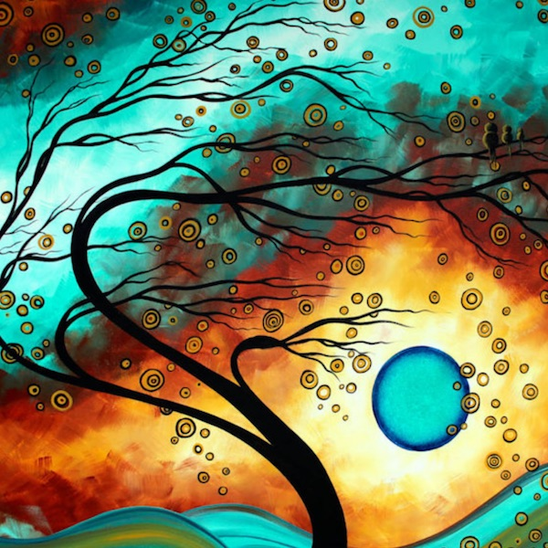
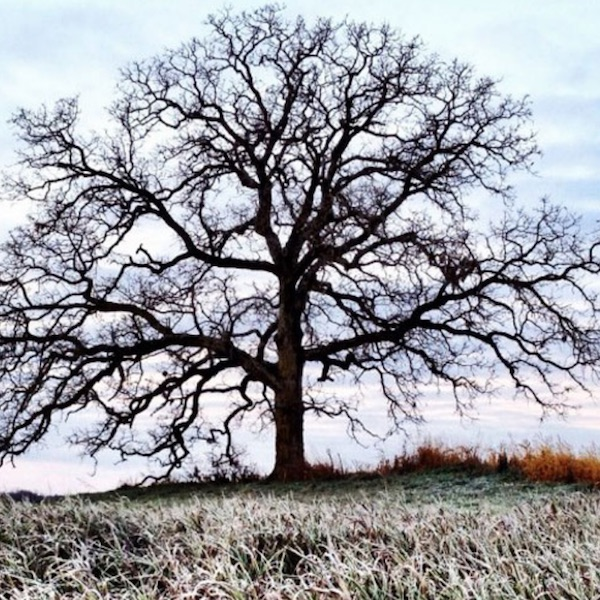
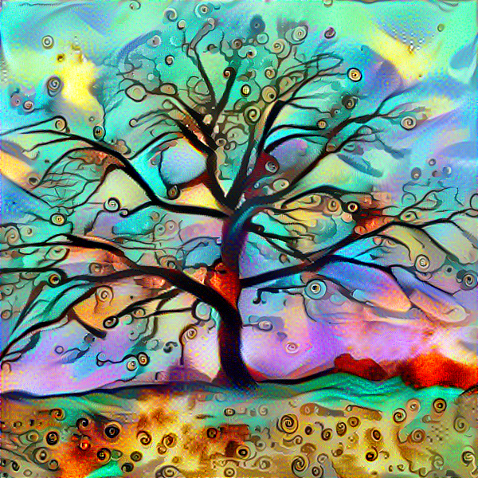

# Neural_Style_Transfer

This is an implementation of the paper [A Neural Algorithm of Artistic Style](https://arxiv.org/abs/1508.06576) by Gatys, et al.

## Results

Below is an example of art generated by this code. It combines the style of a lovely painting by [Megan Ducanson](https://www.wayfair.com/keyword.php?keyword=megan+duncanson+canvas) with a photograph of a tree in a field. Full disclosure: some of the results I did not post were quite terrible looking, so do not be discouraged if your first few attempts do not come out as you had hoped. I recommend experimenting a bit to get a feel for what works well and what doesn't. The same style image can have a very different effect on different content images, or with different hyperparameters.

<div><p align='center'>Style Image:</p><p align='center'></p></div><div><p align='center'>Content Image:</p><p align='center'></p></div><div><p align='center'>Resulting Generated Image:</p><p align='center'></p></div></p>

## Create your own

To use:

1. Download a pretrained VGG19 model [here](http://www.vlfeat.org/matconvnet/models/imagenet-vgg-verydeep-19.mat), and place it in the project directory.
2. Replace ```images/content.jpg``` with a photo of your choice (600x600).
3. Replace ```images/style.jpg``` with an art image of your choice (600x600).
4. Navigate into the project directory in terminal
5. Type ```python neural_style_transfer.py```
6. That's it! Training will take several hours. Intermediate images will be generated at regular intervals.
7. Check the ```output``` folder for results.


## Acknowledgements

In developing this code I drew on the following implementations:
* [Tensorflow Implementation of A Neural Algorithm of Artistic Style](http://www.chioka.in/tensorflow-implementation-neural-algorithm-of-artistic-style)
* [Painting like Van Gogh with Convolutional Neural Networks](http://www.subsubroutine.com/sub-subroutine/2016/11/12/painting-like-van-gogh-with-convolutional-neural-networks)
